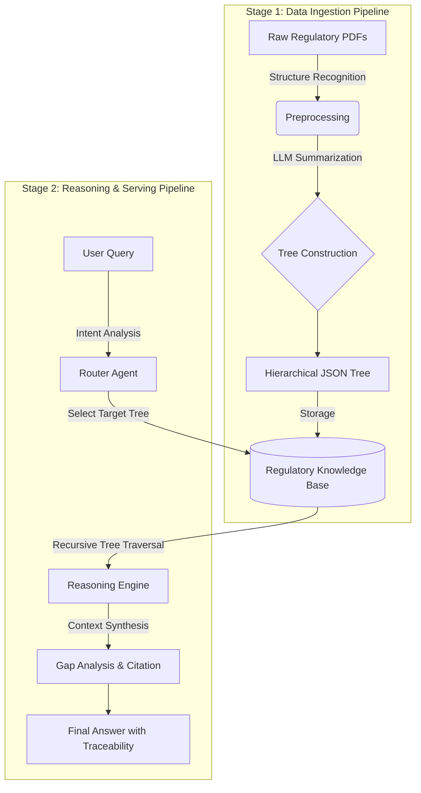

# 🏥 Medi-Reg Master (AI Regulatory Affairs Specialist)

> **"An AI Platform replacing or strongly assisting Regulatory Affairs (RA) Specialists."**

[](https://www.python.org/)
[](https://fastapi.tiangolo.com/)
[](https://nextjs.org/)
[](https://deepmind.google/technologies/gemini/)
[](LICENSE)

## 📖 Introduction

**Medi-Reg Master** is a comprehensive AI solution designed to navigate the complex landscape of medical device regulations (FDA, ISO, MFDS, MDR). Unlike simple search engines, it acts as an intelligent **RA Specialist**, analyzing thousands of pages of cross-referenced regulations to provide answers with **precise legal traceability**.

### The Problem
Medical regulations are vast and intricately cross-referenced. Traditional **Vector RAG (Retrieval-Augmented Generation)** methods chunk documents arbitrarily, losing critical context and hierarchy. This often leads to **hallucinations**—a fatal flaw in regulatory compliance where accuracy is paramount.

### The Solution: Tree-Based Indexing
We solve this by adopting the **Hierarchical Tree Indexing** approach (inspired by [VectifyAI/PageIndex](https://github.com/VectifyAI/PageIndex)). Instead of flattening text into vectors, we parse documents into logical **JSON Trees** (Chapter → Section → Article). This allows the AI to understand the "parent-child" relationships of regulations and perform deep-dive reasoning without losing context.

---

## 🚀 Key Features

* **🌳 Context-Aware Tree Indexing:** Converts PDF regulations into deep hierarchical JSON structures, preserving the logical flow of legal documents.
* **🎯 Zero Hallucination & Traceability:** Every answer is strictly grounded in the index, citing specific **Section IDs** and **Page Numbers** (e.g., *"Reference: IEC 62304, Section 5.2.1"*).
* **🧠 Recursive Reasoning:** Implements a "Deep Dive" traversal algorithm that starts from high-level chapters and drills down to specific clauses, mimicking human expert reasoning.
* **⚡ Hybrid Architecture:** Combines a high-performance **Python/FastAPI** backend for complex logic with a modern **Next.js** frontend for an intuitive user experience.

---

## 🛠 Tech Stack

### Backend (The Brain)
* **Core Language:** Python 3.10+
* **Framework:** FastAPI
* **AI Engine:** Google Gemini Pro Models (via Google GenAI SDK)
* **Data Processing:** PyPDF / LlamaParse (Structure Extraction)
* **Data Structure:** Nested JSON & Hierarchical Trees (Custom implementation of PageIndex)

### Frontend (The Face)
* **Framework:** Next.js 14 (App Router)
* **Language:** TypeScript
* **Styling:** Tailwind CSS
* **State Management:** React Hooks & LocalStorage Persistence

---

## 🏗 Architecture & Pipeline

This project consists of two main pipelines: **Data Ingestion** and **Reasoning**.


Stage 1: Data Ingestion (Indexing)

Raw Data Collection: Ingest PDFs from FDA, ISO, MFDS, etc.

Structure Parsing: Identify Table of Contents (ToC) to understand document hierarchy.

Tree Construction: Use LLM to generate summaries and metadata for each node, building a parent-child tree structure.

Stage 2: Reasoning (Serving)

Router Agent: Analyzes user intent to select the relevant regulatory tree (e.g., selecting ISO 14971 for risk management queries).

Deep Dive Traversal: The engine traverses from root nodes down to leaf nodes to find precise information.

Response Generation: Synthesizes findings and tags sources to ensure traceability.

💾 Getting Started
Prerequisites

Python 3.10 or higher

Node.js 18 or higher

Google AI Studio API Key

1. Clone the Repository

Bash
git clone [https://github.com/dalgona039/Medi-Reg-Master.git](https://github.com/dalgona039/Medi-Reg-Master.git)
cd Medi-Reg-Master
2. Backend Setup

Bash
# Create and activate Conda environment
conda create -n medireg python=3.13 -y
conda activate medireg

# Install Python dependencies
pip install -r requirements.txt

# Configure Environment Variables
# Create a .env file and add your API key
echo "GOOGLE_API_KEY=your_api_key_here" > .env

# Run the FastAPI Server
python main.py
3. Frontend Setup

Bash
cd frontend

# Install Node dependencies
npm install

# Run the Development Server
npm run dev
Access the dashboard at http://localhost:3000.

🙌 Acknowledgements & Inspiration
This project is built upon the theoretical framework of VectifyAI/PageIndex.

We adopted the concept of "Tree-based Indexing" to overcome the limitations of flat vector search in high-stakes domains. Medi-Reg Master specializes this architecture for the Medical Device Regulatory Affairs (RA) domain, proving that structured AI reasoning is essential for compliance and safety.

📜 License
This project is licensed under the MIT License - see the LICENSE file for details.


### 💡 적용 방법

1.  프로젝트 루트 폴더(`medireg-master`)의 `README.md` 파일을 엽니다.
2.  위의 내용을 전부 복사해서 붙여넣습니다.
3.  터미널에서 아래 명령어로 깃허브에 반영합니다.

```bash
git add README.md
git commit -m "Update README with detailed project specs and pipeline"
git push origin main
```
